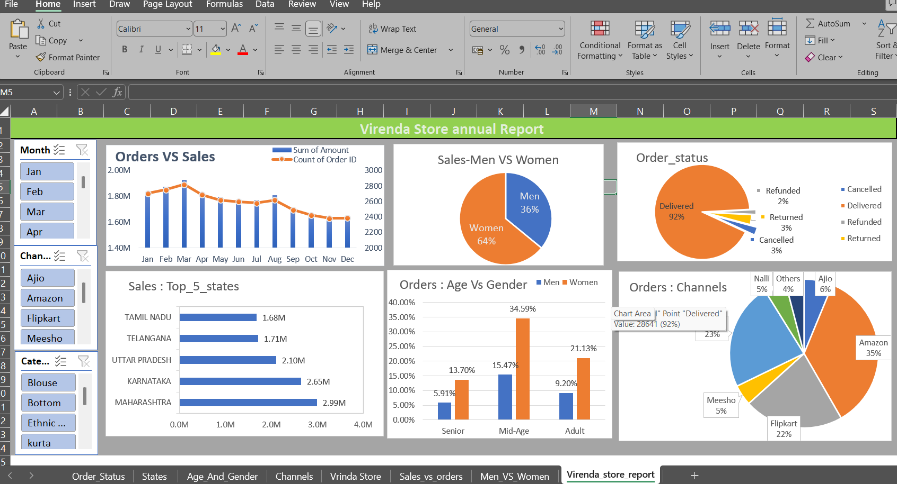

# Vrinda Store Sales Analysis (Excel Project)

## Project Overview
This project analyzes retail sales data from Vrinda Store to understand customer behavior, sales trends, and regional performance.

The dataset contains more than 31,000 retail orders including customer demographics, order status, sales channels and revenue information.

## Business Questions
• Compare sales and orders using a single chart  
• Identify which month recorded the highest sales and orders  
• Determine whether men or women purchased more in 2022  
• Analyze different order statuses in 2022  
• Identify the top 10 states contributing to sales  
• Explore the relationship between age group and gender based on number of orders  
• Identify which sales channel contributes the maximum sales  
• Determine the highest selling product category  

## Key Insights
• Women contribute approximately 65% of total purchases  
• Maharashtra, Karnataka and Uttar Pradesh are the top three states contributing to sales  
• The 30–49 age group contributes nearly 50% of total orders  
• Amazon, Flipkart and Myntra together contribute around 80% of total sales  

## Business Recommendation
Marketing campaigns should target women aged 30–49 living in Maharashtra, Karnataka and Uttar Pradesh by offering promotions and discounts through Amazon, Flipkart and Myntra, which are the highest performing sales channels.

## Tools Used
• Microsoft Excel  
• Data Cleaning  
• Pivot Tables  
• Charts  
• Dashboard  

## Dataset Size
31,000+ retail orders  
21 columns of sales and customer data

## Dashboard Preview

